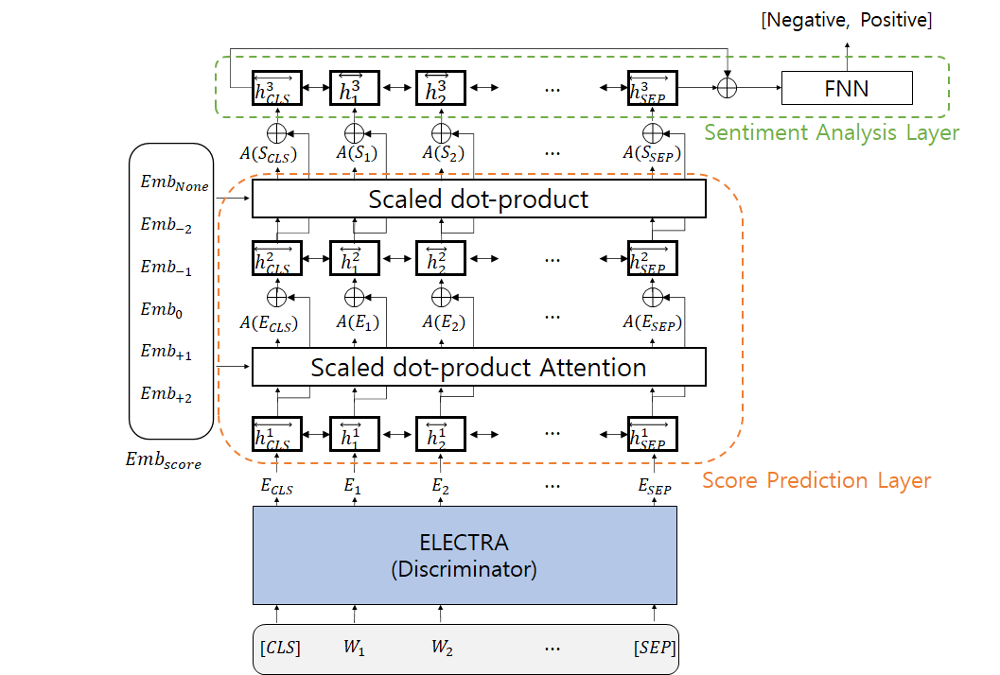

# Sentiment analysis model for Korean movie review
Code for HCLT 202 paper: *[Movie Revies Sentiment Analysis Considering the Order in which Sentiment Words Appear](http://koreascience.or.kr/article/CFKO202030060610812.page?&lang=ko)*

## Dependencies
- python 3.7
- PyTorch 1.5.0
- Transformers 2.11.0
- Seqeval 1.2.2

All code only supports running on Linux.

# Model Structure




## Data

Naver sentiment movie corpus v1.0: *[NSMC](https://github.com/e9t/nsmc)*

## Train & Test

```
python main.py
```

## Results on NSMC

| Model | Acc |
|---|--------- |
| KUSA | 90.81% |
